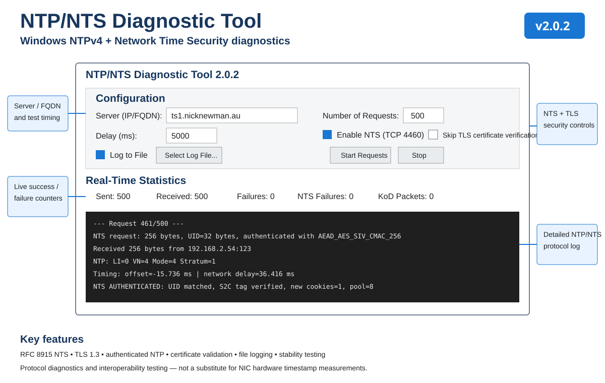

# NTP/NTS Diagnostic Tool

A cross-platform diagnostic utility for testing **NTPv4** and **Network Time Security (NTS)** servers on Windows, Linux, and macOS.

Version **2.0.2** remains the known-good NTS interoperability baseline. **v2.1.0 is the current development version** and adds an integrated NTP peer test responder and fault-injection/peer-monitoring tools. It performs real NTS Key Establishment over TLS 1.3, negotiates `ntske/1`, derives client-to-server and server-to-client keys with the TLS exporter, exchanges NTS cookies, creates authenticated NTP requests using AEAD AES-SIV-CMAC-256, verifies authenticated replies, and reports NTP offset and network delay.

*Annotated overview of the v2.0.2 interface and major diagnostic features.*

## Quick start

1. Download the standalone Windows executable from the latest GitHub Release.
2. Enter the NTP/NTS server hostname or IP address.
3. Leave **Enable NTS** checked for RFC 8915 testing, or clear it for plain NTP.
4. Keep TLS certificate verification enabled for normal NTS operation.
5. Choose the request count and delay, then start the test.
6. Optionally enable **Log to File** and choose a destination with **Select Log File...** for long stability runs.
7. Click **Start Requests**. Use **Stop** to interrupt an active run.
8. Watch **Real-Time Statistics** for Sent, Received, Failures, NTS Failures, and KoD Packets.
9. For NTS, look for **NTS-KE SUCCESS** followed by **NTS AUTHENTICATED** on each successful exchange.

See the [complete user guide](docs/wiki/Home.md) for field descriptions, examples, output interpretation, certificate troubleshooting, and timing limitations.

## NTP peer monitoring and fault injection

v2.1.0 adds an integrated **NTP Peer Test Responder**. It listens for incoming NTP client/peer requests, logs the source address, request size and selected response behavior, and sends controlled replies so peer implementations can be monitored and validated.

The responder preserves the original peer-test behaviors: `valid`, `kod` (RATE), `bad-originate`, `short` (16-byte malformed reply), and `duplicate` T3. Advanced modes add `kod-deny`, `kod-rstr`, `wrong-mode`, `bad-version`, `zero-t2`, `zero-t3`, `li-alarm`, `stratum-16`, `drop`, `delayed`, ±100 ms timestamp offset, 100 ms processing delay, and full-response `replay`.

This makes the tool useful in both directions: it can actively test an NTP/NTS server, or act as a controlled NTP server endpoint while monitoring how another NTP peer/client behaves under valid, malformed, stale, delayed, unsynchronized and policy-response conditions.

### Windows startup permissions

On Windows, v2.1.0 checks whether it is running with Administrator privileges. If it is not elevated, the application offers **Restart as Administrator** through the normal Windows UAC prompt, while still allowing the operator to continue without elevation.

When running elevated, startup also offers to create/refresh a Windows Defender Firewall inbound rule named `NTP-NTS Diagnostic Tool Peer Responder`. The rule is deliberately limited to **UDP/123** and **Domain/Private** profiles; it does not open the Public profile. The firewall change is opt-in and is never silently applied.

Elevation is primarily relevant to the peer responder and firewall configuration. The normal NTP/NTS diagnostic client does not require Administrator privileges.

### Automated peer responder self-test

v2.1.0 also includes **Run Self-Test Suite**. The suite starts each responder mode on loopback using an ephemeral UDP port, generates controlled NTP requests, inspects the resulting wire packets, and reports explicit `[PASS]` / `[FAIL]` results in the Running Log. It covers the normal response, RATE/DENY/RSTR KoD, bad originate, short response, wrong mode/version, zero T2/T3, LI alarm, stratum 16, duplicate T3, replay, drop/timeout, delayed response, ±100 ms timestamp shifts, and 100 ms processing delay.

The self-test validates the **responder's generated behavior**. It intentionally does not claim that an external peer accepted or rejected a condition; use the responder log together with the external peer's own monitoring/status for interoperability conclusions.

> **Development note:** v2.1.0 is not yet the tagged stable release. Keep v2.0.2 for the validated public-NTS baseline until v2.1.0 regression testing is complete.

## Validated interoperability

2.0.2 has completed repeated authenticated NTS exchanges against Cloudflare's public `time.cloudflare.com` service and an independent ESP32-P4 NTS server.

## Security

TLS certificate verification is enabled by default. **Skip TLS Verify** is intended only for controlled development and certificate-diagnostic testing. The application intentionally does not log derived NTS keys.

## Platform distributions

GitHub Actions builds standalone distributions from the highest versioned `ntp_nts_tester_v*.py` source:

- **Windows x86-64** — standalone `.exe`.
- **Linux x86-64** — standalone executable packaged as `NTP-NTS-Diagnostic-Tool-Linux-x86_64.tar.gz`.
- **macOS Apple Silicon** — native macOS application bundle packaged as `NTP-NTS-Diagnostic-Tool-macOS-AppleSilicon.tar.gz`.
- **macOS Intel** — native Intel macOS application bundle packaged as `NTP-NTS-Diagnostic-Tool-macOS-Intel.tar.gz`.

Pushes and pull requests build CI artifacts. A `v*` tag additionally attaches the platform archives to the GitHub Release.

### Platform permissions

The Windows v2.1.0 build provides its UAC and Windows Defender Firewall assistance in-app.

On **Linux**, binding the peer responder to UDP/123 may require root or the `CAP_NET_BIND_SERVICE` capability depending on the system's privileged-port policy. Firewall configuration remains under the administrator's control.

On **macOS**, UDP/123 may require elevated privileges depending on system configuration. Incoming connections can also be affected by macOS firewall/security policy. The application does not automatically elevate itself or alter firewall policy on Linux/macOS.

The macOS CI artifacts are currently unsigned/not notarized development builds. Gatekeeper may therefore require explicit user approval. Production macOS distribution should add Developer ID signing and Apple notarization before being described as a trusted end-user package.

Developers can build the Windows version with `build_windows.bat`; Linux/macOS distributions are produced by `.github/workflows/linux-macos-build.yml`.

## Standards

- RFC 5905 — Network Time Protocol Version 4
- RFC 8915 — Network Time Security for the Network Time Protocol
- RFC 5297 — Synthetic Initialization Vector authenticated encryption

## Timing note

Client T1/T4 are application/userspace observations rather than NIC hardware timestamps. This application is intended for protocol diagnostics and interoperability testing, not as a sub-microsecond hardware timestamp reference.

## License

MIT.
