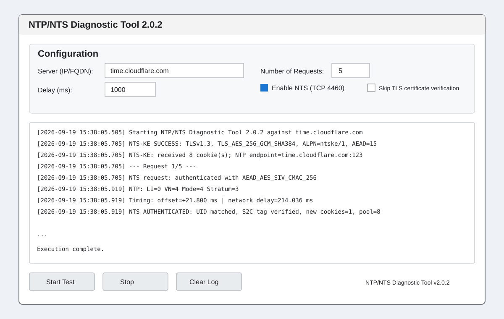

# NTP/NTS Diagnostic Tool — User Guide

This guide explains how to use **NTP/NTS Diagnostic Tool v2.0.2** to test conventional NTPv4 servers and RFC 8915 Network Time Security servers from Windows.



## 1. Download and run

Download `NTP-NTS-Diagnostic-Tool.exe` from the **v2.0.2 GitHub Release**. The packaged Windows build is standalone; Python is not required.

Windows may display a reputation warning for an unsigned executable. Verify that the file came from this repository's release page. The v2.0.2 release asset published by the project workflow has SHA-256:

`9c6f5a236f431ac7d1bbd8e6799e629df348452bf8e058a7e3fe75fa1047fa7b`

## 2. Configuration

**Server (IP/FQDN)** is the NTP or NTS server to test. For public NTS testing, `time.cloudflare.com` is a useful interoperability target. For a private server, enter its certificate-valid DNS name when TLS verification is enabled.

**Number of Requests** controls how many UDP NTP exchanges are performed. Five requests is a useful quick diagnostic sample.

**Delay (ms)** controls the pause between requests. The default 1000 ms sends one request per second.

**Enable NTS (TCP 4460)** switches from plain NTP testing to RFC 8915 NTS. When enabled, the program first performs NTS-KE over TLS on TCP port 4460 and then sends authenticated NTP traffic to the negotiated NTP endpoint, normally UDP port 123.

**Skip TLS certificate verification** disables certificate validation. Leave this unchecked for normal operation. It is intended only for controlled development and certificate troubleshooting.

## 3. Test a normal NTP server

Enter the server hostname or IP address, disable **Enable NTS**, choose the request count and delay, then start the test.

A valid reply reports fields such as `LI`, `VN`, `Mode`, and `Stratum`, followed by calculated offset and network delay. A stratum-zero response is treated as a Kiss-o'-Death response and its reference identifier is reported.

## 4. Test an NTS server

Enter the server's certificate-valid hostname, enable **Enable NTS**, leave TLS verification enabled, and start the test.

A successful NTS-KE phase should include output similar to:

```text
NTS-KE SUCCESS: TLSv1.3, TLS_AES_256_GCM_SHA384, ALPN=ntske/1, AEAD=15
NTS-KE: received 8 cookie(s); NTP endpoint=time.cloudflare.com:123
NTS-KE: C2S/S2C keys derived with TLS exporter
```

Each successful authenticated NTP exchange should then end with a line similar to:

```text
NTS AUTHENTICATED: UID matched, S2C tag verified, new cookies=1, pool=8
```

That line is the important end-to-end NTS result: the response matched the request UID and its server-to-client authentication tag verified.

## 5. Understanding the output

**NTS-KE SUCCESS** means the TLS 1.3 key-establishment connection succeeded, the required `ntske/1` ALPN was negotiated, and an acceptable NTS AEAD algorithm was selected.

**AEAD=15** is AEAD_AES_SIV_CMAC_256.

**received N cookie(s)** shows how many opaque NTS cookies were issued by the server. Cookies let later UDP requests authenticate without maintaining the TLS connection.

**LI** is the NTP leap indicator. **VN** is the NTP version. **Mode=4** is a server response. **Stratum** reports the server's NTP stratum.

**offset** is the standard four-timestamp NTP offset estimate using T1/T2/T3/T4. **network delay** is the corresponding round-trip delay estimate.

**new cookies=1, pool=8** means the authenticated response returned a replacement cookie and the client retained a full working cookie pool.

## 6. Certificate-name errors

With TLS verification enabled, the name entered in **Server** must match the server certificate.

For example, connecting to a device by raw IP can fail with:

```text
certificate is not valid for IP address 192.168.2.54
```

if the certificate contains a DNS Subject Alternative Name but does not contain that IP address as an IP SAN. The preferred fix is to use the DNS hostname covered by the certificate. Adding the IP address to the certificate SAN is another option when raw-IP access is required.

Do not treat **Skip TLS certificate verification** as the normal fix; it removes server identity verification.

## 7. Common failures

**Connection refused / timeout on TCP 4460:** the NTS-KE service is unreachable, not listening, or blocked by a firewall.

**ALPN error:** the server did not negotiate the required `ntske/1` protocol.

**Certificate validation error:** check the hostname, certificate SAN, trust chain, expiry, and local trust environment.

**No cookies returned:** NTS-KE completed without the cookie material required for authenticated NTP requests.

**NTS response authentication failed:** the returned NTP packet could not be authenticated with the negotiated server-to-client key.

**Originate timestamp mismatch or UID mismatch:** the received packet does not correspond to the request being validated.

## 8. Interpreting timing results

The program calculates standard NTP offset and delay, but Windows client T1/T4 are userspace/socket/system-clock observations rather than Ethernet NIC hardware timestamps. Network scheduling, OS scheduling, path asymmetry, and server timestamp placement can therefore affect the measurements.

Use the tool for protocol validation, interoperability testing, and practical timing diagnostics. Do not interpret its displayed offset as a sub-microsecond hardware timestamp measurement.

## 9. Example: public interoperability test

Use:

- Server: `time.cloudflare.com`
- Requests: `5`
- Delay: `1000 ms`
- Enable NTS: checked
- Skip TLS certificate verification: unchecked

A successful run should show NTS-KE success followed by authenticated NTP replies. Version 2.0.2 has been validated against this public service.

## 10. Example: private NTS appliance/server

Use the DNS hostname present in the server certificate, enable NTS, and keep TLS verification enabled. If DNS resolves that hostname to a private LAN address, that is fine: certificate identity is checked against the hostname you requested, not merely against the returned IP address.

This workflow was used successfully against an independent ESP32-P4 NTS implementation.

## 11. Logging and security

The application logs protocol state needed for diagnostics but intentionally does **not** log the derived C2S/S2C NTS keys.

Before posting logs publicly, review them for private hostnames, internal IP addresses, infrastructure details, or other information specific to your environment.

## 12. Standards implemented

The diagnostic client is based on:

- RFC 5905 — Network Time Protocol Version 4
- RFC 8915 — Network Time Security for the Network Time Protocol
- RFC 5297 — Synthetic Initialization Vector authenticated encryption

Version 2.0.2 is retained as the project's known-good NTS interoperability baseline.
